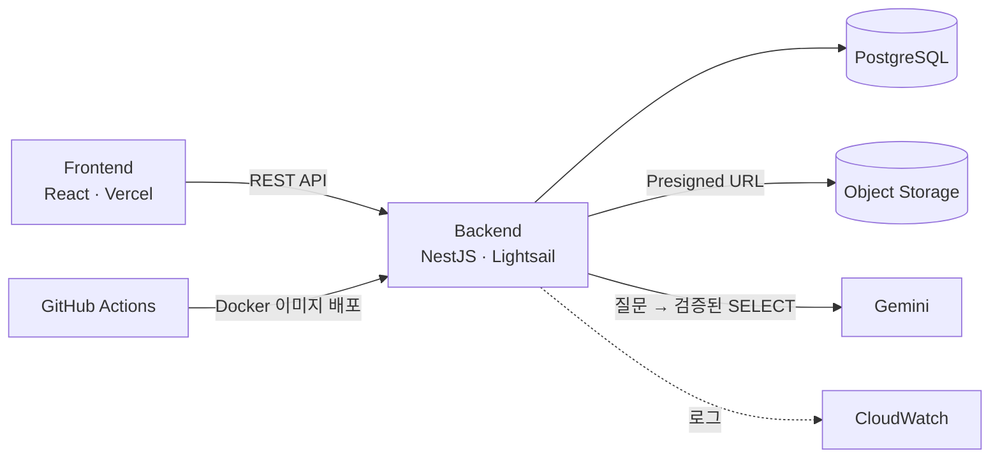

<div align="center">


<h3>합 맞추기 전에, 일정부터 맞춰요</h3>

날짜 정하기, 세션 짜기, 연습곡 고르기까지<br>
밴드가 함께 정할 일을 **BandCo**에서 한 번에 해요.

</div>

<br>

<p align="center">
  
  
  
</p>

## 주요 기능

- **AI 물어보기** “다음 합주 몇 명 와?”처럼 물으면 밴드 데이터에서 찾아 답해요. 어떤 조건으로 찾았는지도 함께 알려 줘요.
- **일정 투표** 후보 날짜와 시간대를 정해 투표를 열면, 멤버는 되는 시간을 드래그로 골라요. 시간대마다 가능한 인원이 바로 쌓여요.
- **공연 스페이스** 공연마다 합주와 회의를 타임라인으로 정리해요. 일정을 열면 연습할 곡과 키, 파트별 멤버와 장비까지 보여요.
- **밴드 홈** 공지, 이번 주 일정, 준비 중인 공연을 한 화면에서 봐요.
- **라이브러리** 합주곡과 연습실을 모아 두고, 곡마다 키·BPM·음원 링크를 저장해요.
- **초대 · 멤버 관리** 초대 링크나 이름 검색으로 멤버를 추가하고, 권한과 팀을 관리해요.

## 기술 스택

- **Frontend** React 19, TypeScript, Vite, TanStack Router · Query, Tailwind CSS v4, Radix UI, MSW, Vitest
- **Backend** NestJS 11, Prisma 6, PostgreSQL, Swagger, Jest
- **Infra** Docker, GitHub Actions, AWS Lightsail, CloudWatch, Vercel

## 아키텍처



<details>
<summary><b>프로젝트 구조</b></summary>

<br>

```text
.
├── frontend/            # React 앱
│   └── src/
│       ├── app/         # 앱 진입점, 프로바이더, 레이아웃
│       ├── pages/       # TanStack Router 파일 기반 라우트
│       ├── widgets/     # 여러 기능을 조합한 화면 단위 블록
│       ├── features/    # 사용자 행동 단위 기능
│       ├── entities/    # 도메인 모델과 API
│       ├── shared/      # 공통 UI, 유틸, API 클라이언트
│       └── mocks/       # MSW 목 핸들러
├── backend/             # NestJS API
│   ├── src/modules/     # bands, schedules, schedule-polls, songs, teams ...
│   ├── prisma/          # 스키마와 마이그레이션
│   └── docs/            # API 명세, 설계 문서, Git 규칙
├── infra/               # Discord 알림
├── scripts/             # PR 생성 스크립트
└── docs/readme/         # README 이미지
```

</details>
