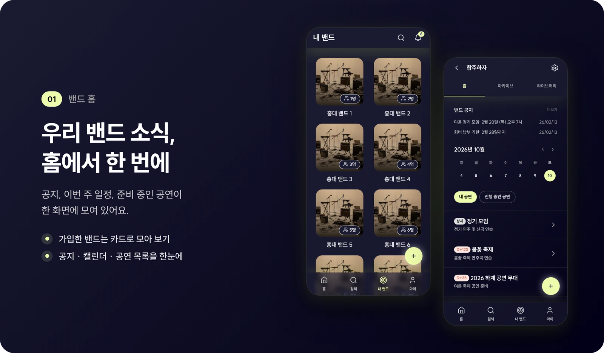
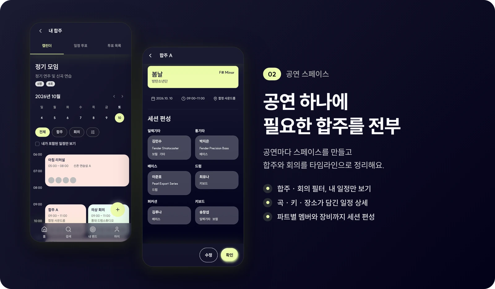
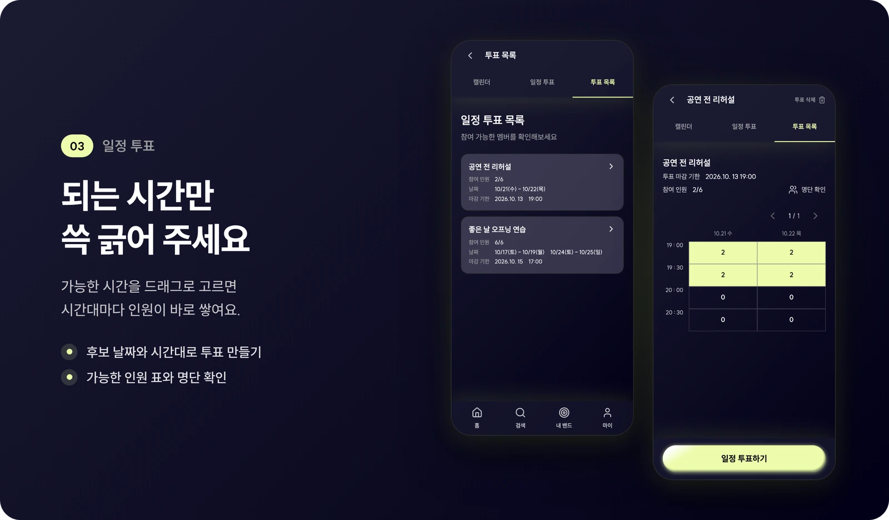
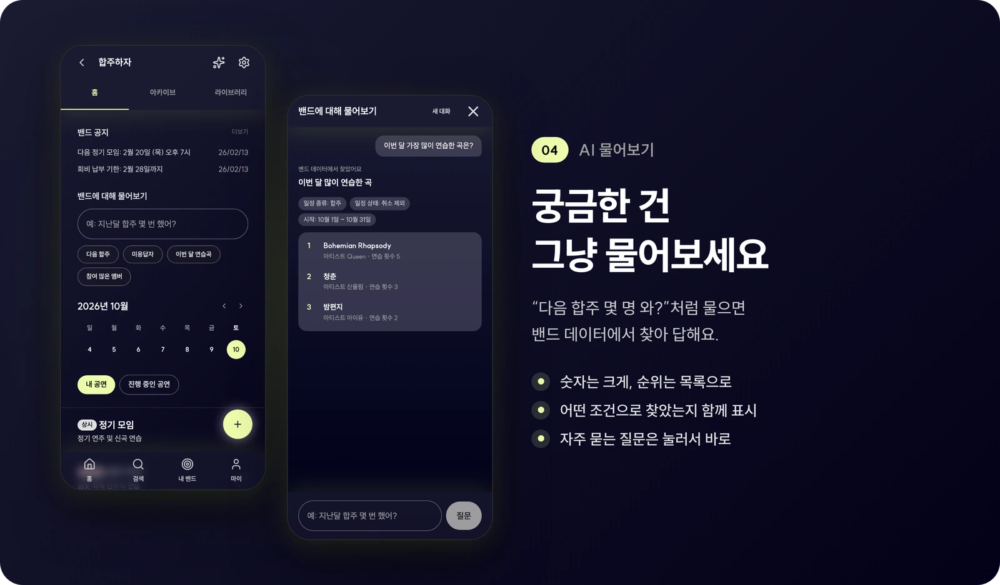
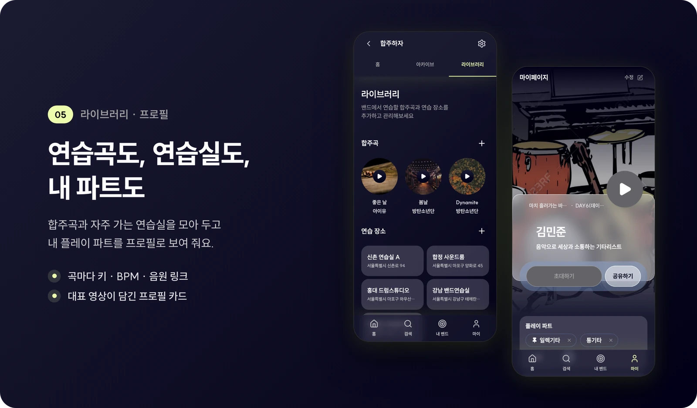
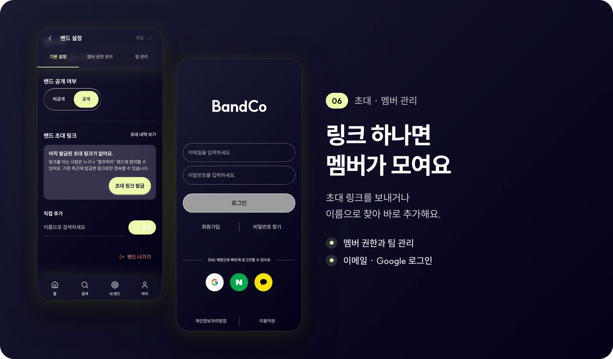
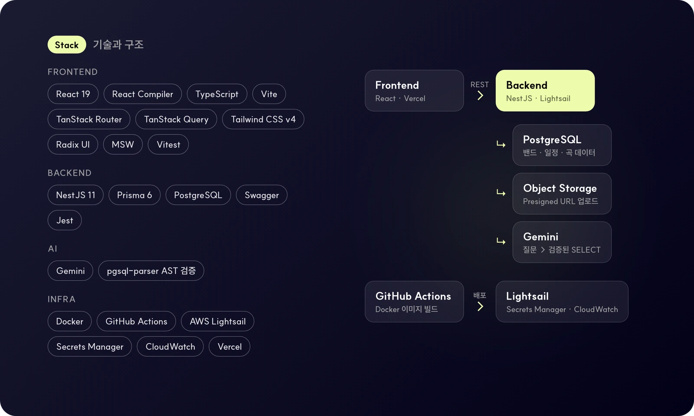

<div align="center">


<br>
<br>


&nbsp;

&nbsp;


<br>
<br>















</div>

<details>
<summary><b>프로젝트 구조</b></summary>

<br>

```text
.
├── frontend/            # React 앱
│   └── src/
│       ├── app/         # 앱 진입점, 프로바이더, 레이아웃
│       ├── pages/       # TanStack Router 파일 기반 라우트
│       ├── widgets/     # 여러 기능을 조합한 화면 단위 블록
│       ├── features/    # 사용자 행동 단위 기능
│       ├── entities/    # 도메인 모델과 API
│       ├── shared/      # 공통 UI, 유틸, API 클라이언트
│       └── mocks/       # MSW 목 핸들러
├── backend/             # NestJS API
│   ├── src/modules/     # bands, schedules, schedule-polls, songs, teams ...
│   ├── prisma/          # 스키마와 마이그레이션
│   └── docs/            # API 명세, 설계 문서, Git 규칙
├── infra/               # Discord 알림
├── scripts/             # PR 생성 스크립트
└── docs/readme/         # README 이미지
```

</details>
