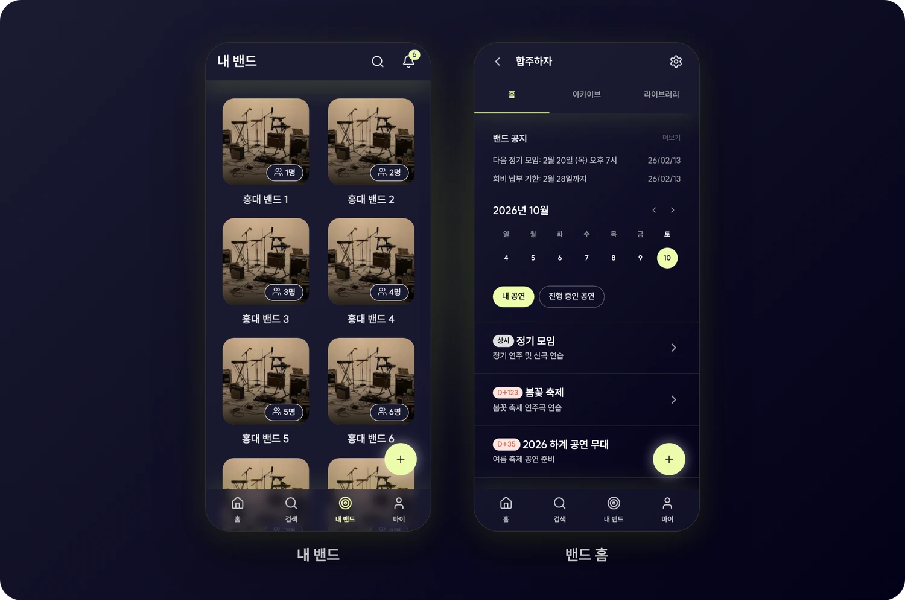
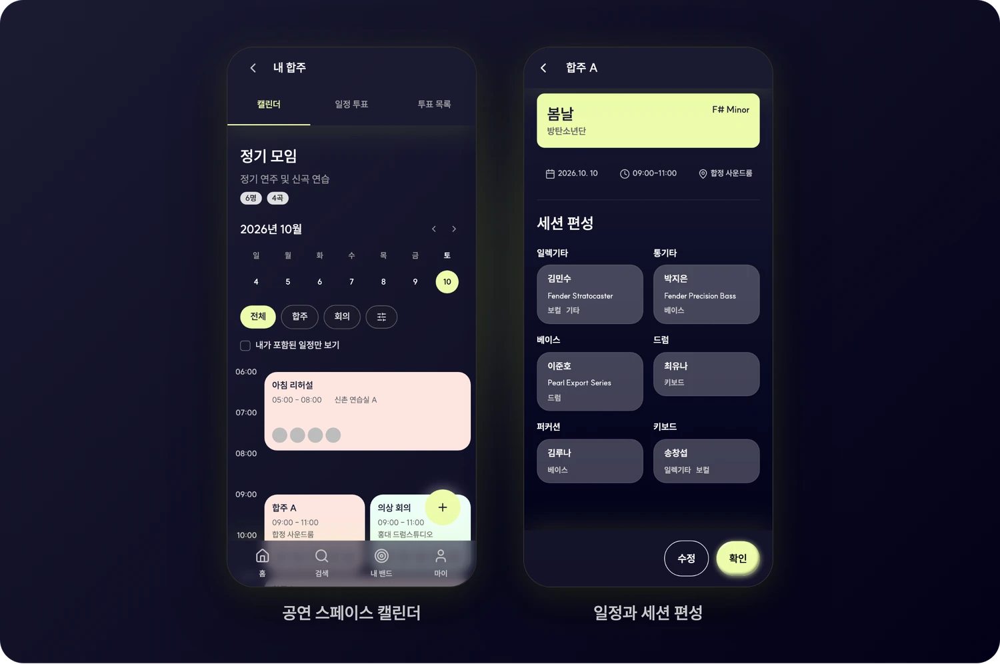
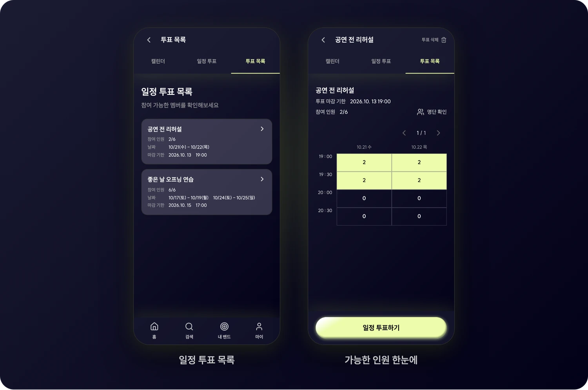
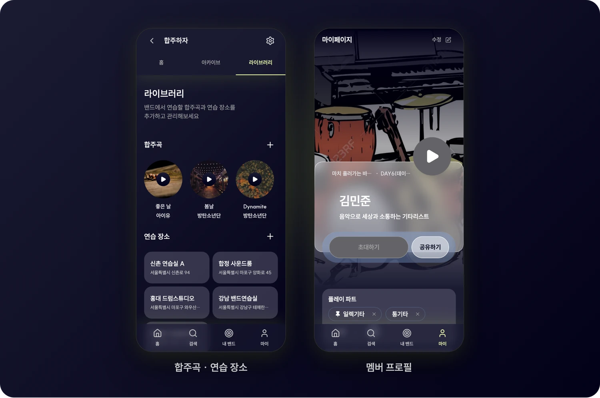
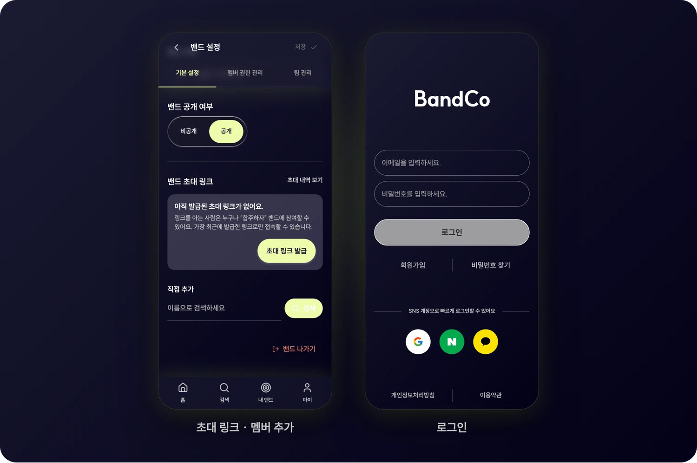
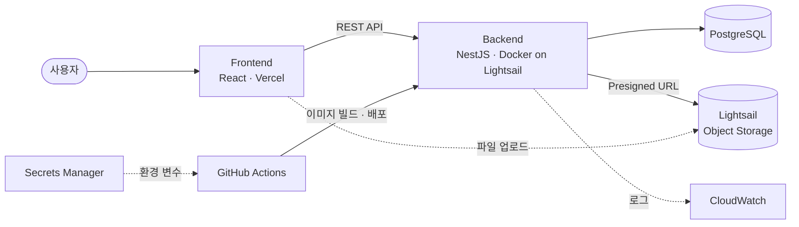

<div align="center">


<br>

**BandCo · Band + Community**

밴드 멤버가 합주 일정, 공연 준비, 곡과 연습실 정보를 함께 관리하는 모바일 웹 서비스

<br>


</div>

<br>

## 미리보기

<p align="center">
  
  &nbsp;&nbsp;
  
</p>
<p align="center"><sub>공연 스페이스에서 일정 확인하기 · 가능한 시간을 드래그해 일정 투표하기</sub></p>

## 핵심 기능

### 1. 밴드 홈

가입한 밴드를 카드로 모아 보고, 밴드에 들어가면 공지와 이번 주 캘린더, 준비 중인 공연을 한 화면에서 확인해요.



### 2. 공연 스페이스와 일정

공연 하나를 준비하는 데 필요한 합주와 회의를 스페이스 하나에 모아요.

- **타임라인 캘린더**: 날짜별 일정을 시간 순서로 보고, 합주·회의로 거르거나 내가 포함된 일정만 볼 수 있어요.
- **일정 상세**: 연습할 곡과 키, 날짜·시간·장소를 보여 줘요.
- **세션 편성**: 파트별로 누가 어떤 장비로 들어오는지 정리해요.



### 3. 일정 투표

다 같이 모일 수 있는 시간을 투표로 찾아요.

- 후보 날짜와 시간대를 정해 투표를 만들어요.
- 멤버는 참여할 수 있는 시간을 **드래그해서** 골라요.
- 시간대마다 가능한 인원이 표에 쌓이고, 명단도 확인할 수 있어요.



### 4. 라이브러리와 멤버 프로필

- **라이브러리**: 밴드가 연습할 합주곡과 자주 쓰는 연습 장소를 등록해요. 곡마다 키, BPM, 음원 링크, 커버 이미지를 함께 저장해요.
- **멤버 프로필**: 플레이 파트와 대표 영상을 담은 프로필 카드를 만들고 공유해요.



### 5. 초대와 멤버 관리

- 초대 링크를 발급하거나 이름으로 검색해 멤버를 바로 추가해요.
- 밴드 설정에서 멤버 권한과 팀을 관리해요.
- 이메일과 Google 계정으로 로그인해요.



<br>

## 기술 스택

| 영역     | 기술                                                                                                         |
| -------- | ------------------------------------------------------------------------------------------------------------ |
| Frontend | React 19 (React Compiler), TypeScript, Vite, TanStack Router · Query, Tailwind CSS v4, Radix UI, MSW, Vitest |
| Backend  | NestJS 11, Prisma 6, PostgreSQL, Swagger, Jest                                                               |
| Infra    | Docker, GitHub Actions, AWS Lightsail(서버 · 오브젝트 스토리지), AWS Secrets Manager, CloudWatch, Vercel     |

## 아키텍처



## 프로젝트 구조

```text
.
├── frontend/            # React 앱
│   └── src/
│       ├── app/         # 앱 진입점, 프로바이더, 레이아웃
│       ├── pages/       # TanStack Router 파일 기반 라우트
│       ├── widgets/     # 여러 기능을 조합한 화면 단위 블록
│       ├── features/    # 사용자 행동 단위 기능
│       ├── entities/    # 도메인 모델과 API
│       ├── shared/      # 공통 UI, 유틸, API 클라이언트
│       └── mocks/       # MSW 목 핸들러
├── backend/             # NestJS API
│   ├── src/modules/     # bands, schedules, schedule-polls, songs, teams ...
│   ├── prisma/          # 스키마와 마이그레이션
│   └── docs/            # API 명세, 설계 문서, Git 규칙
├── infra/               # Discord 알림
├── scripts/             # PR 생성 스크립트
└── docs/readme/         # README 이미지
```

## 시작하기

Node.js 24와 pnpm 10을 사용해요.

**Backend**

```bash
cd backend
cp .env.example .env.development   # DATABASE_URL, JWT_SECRET 등을 채워요
pnpm install
pnpm run prisma:migrate:dev
pnpm run start:dev                  # http://localhost:3000
```

**Frontend**

```bash
cd frontend
pnpm install
pnpm dev                            # http://localhost:5173
```

개발 모드에서는 `/api` 요청을 `http://localhost:3000`으로 넘겨요. MSW 목 핸들러도 함께 켜져서, 백엔드 없이도 대부분의 화면을 확인할 수 있어요.

`docker compose up`으로 두 서버를 한 번에 띄울 수도 있어요.

## 문서

- [Git · 커밋 · PR 규칙](backend/docs/git.md)
- [Frontend 컨벤션](frontend/AGENTS.md)
- [Backend 개요](backend/docs/overview.md)
