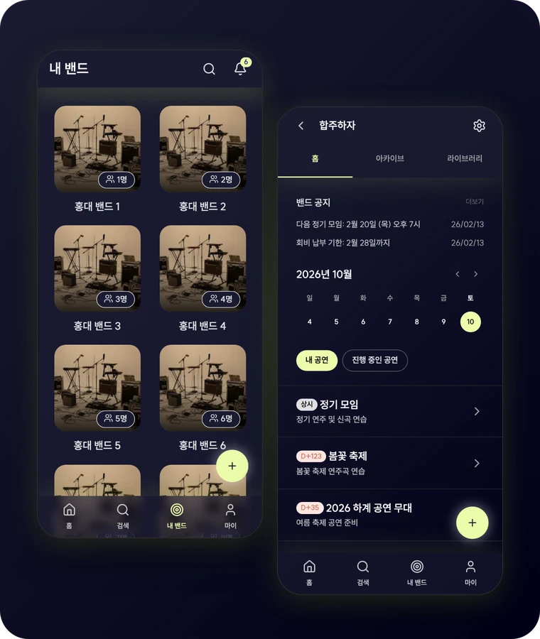
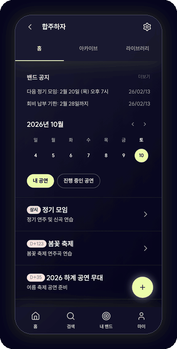
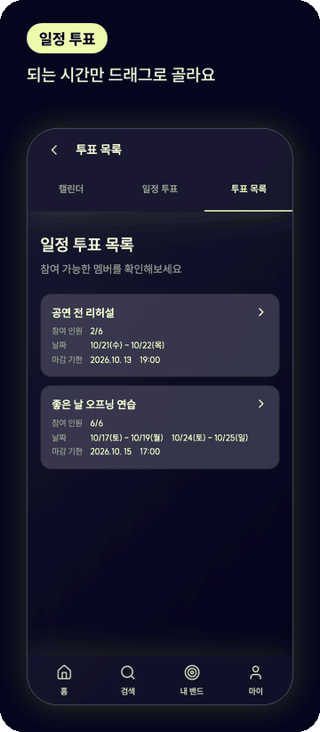
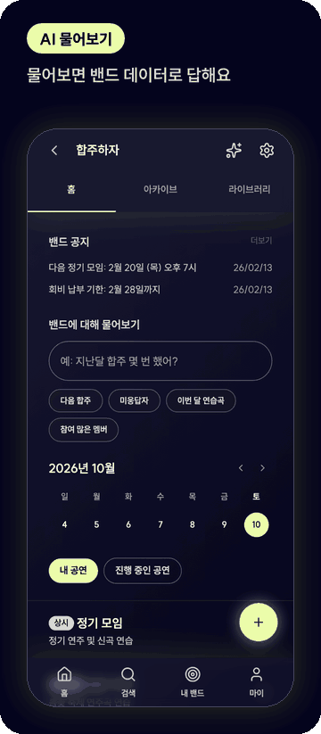
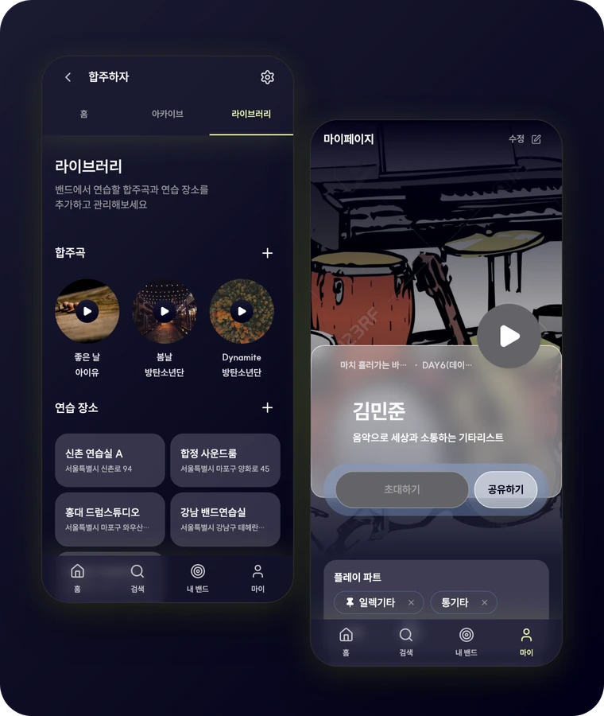
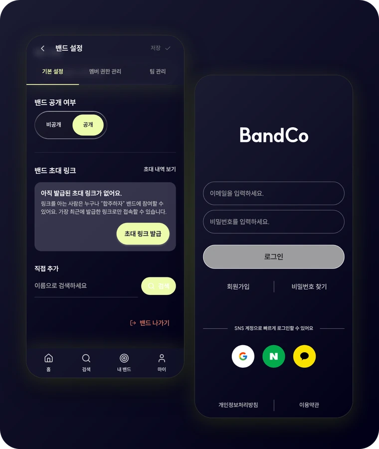
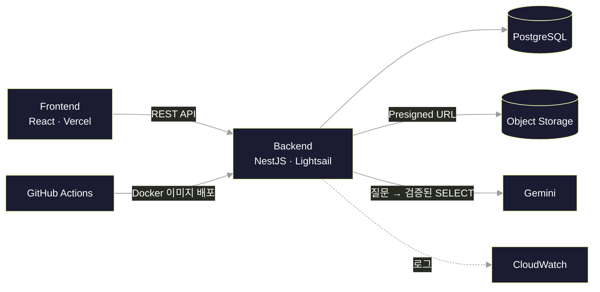

<div align="center">


<h1>합 맞추기 전에, 일정부터 맞춰요</h1>

날짜 정하기, 세션 짜기, 연습곡 고르기까지<br>
밴드가 함께 정할 일을 **BandCo**에서 한 번에 해요.

<br>

<a href="#home">밴드 홈</a> &nbsp;·&nbsp;
<a href="#space">공연 스페이스</a> &nbsp;·&nbsp;
<a href="#poll">일정 투표</a> &nbsp;·&nbsp;
<a href="#ai">AI 물어보기</a> &nbsp;·&nbsp;
<a href="#library">라이브러리</a> &nbsp;·&nbsp;
<a href="#invite">초대</a>

</div>

<br>
<br>

<a name="home"></a>


<sub><b>01 &nbsp;밴드 홈</b></sub>

### 우리 밴드 소식,<br>홈에서 한 번에

공지, 이번 주 일정, 준비 중인 공연이<br>한 화면에 모여 있어요.

- **내 밴드** &nbsp;가입한 밴드를 카드로 모아 봐요
- **밴드 홈** &nbsp;공지와 캘린더, 공연 목록을 한눈에 봐요

<br clear="right">
<br>

<a name="space"></a>


<sub><b>02 &nbsp;공연 스페이스</b></sub>

### 공연 하나에<br>필요한 합주를 전부

공연마다 스페이스를 만들고<br>합주와 회의를 타임라인으로 정리해요.

- **타임라인** &nbsp;합주·회의로 거르거나 내 일정만 봐요
- **일정 상세** &nbsp;연습할 곡과 키, 시간과 장소를 담아요
- **세션 편성** &nbsp;파트별로 누가 어떤 장비로 오는지 정리해요

<br clear="left">
<br>

<a name="poll"></a>


<sub><b>03 &nbsp;일정 투표</b></sub>

### 되는 시간만<br>쓱 긁어 주세요

가능한 시간을 드래그로 고르면<br>시간대마다 인원이 바로 쌓여요.

- **투표 만들기** &nbsp;후보 날짜와 시간대를 정해요
- **드래그 투표** &nbsp;되는 시간을 한 번에 칠해요
- **결과 확인** &nbsp;시간대별 인원과 명단을 봐요

<br clear="right">
<br>

<a name="ai"></a>


<sub><b>04 &nbsp;AI 물어보기</b></sub>

### 궁금한 건<br>그냥 물어보세요

“다음 합주 몇 명 와?”처럼 물으면<br>밴드 데이터에서 찾아 답해요.

- **보기 좋은 답** &nbsp;숫자는 크게, 순위는 목록으로 보여 줘요
- **찾은 조건 표시** &nbsp;어떤 조건으로 찾았는지 함께 알려 줘요
- **바로 묻기** &nbsp;자주 묻는 질문은 눌러서 물어봐요

<br clear="left">
<br>

<a name="library"></a>


<sub><b>05 &nbsp;라이브러리 · 프로필</b></sub>

### 연습곡도, 연습실도,<br>내 파트도

합주곡과 자주 가는 연습실을 모아 두고<br>내 플레이 파트를 프로필로 보여 줘요.

- **합주곡** &nbsp;곡마다 키, BPM, 음원 링크를 저장해요
- **연습 장소** &nbsp;자주 가는 연습실을 주소와 함께 모아요
- **프로필 카드** &nbsp;플레이 파트와 대표 영상을 담아요

<br clear="right">
<br>

<a name="invite"></a>


<sub><b>06 &nbsp;초대 · 멤버 관리</b></sub>

### 링크 하나면<br>멤버가 모여요

초대 링크를 보내거나<br>이름으로 찾아 바로 추가해요.

- **초대** &nbsp;링크를 발급하거나 이름으로 검색해요
- **관리** &nbsp;멤버 권한과 팀을 설정해요
- **로그인** &nbsp;이메일과 Google 계정으로 시작해요

<br clear="left">
<br>
<br>

<div align="center">

<h2>기술 스택</h2>

</div>

| 영역 | 기술 |
| :--- | :--- |
| **Frontend** |         |
| **Backend** |      |
| **AI** |   |
| **Infra** |      |



<details>
<summary><b>프로젝트 구조</b></summary>

<br>

```text
.
├── frontend/            # React 앱
│   └── src/
│       ├── app/         # 앱 진입점, 프로바이더, 레이아웃
│       ├── pages/       # TanStack Router 파일 기반 라우트
│       ├── widgets/     # 여러 기능을 조합한 화면 단위 블록
│       ├── features/    # 사용자 행동 단위 기능
│       ├── entities/    # 도메인 모델과 API
│       ├── shared/      # 공통 UI, 유틸, API 클라이언트
│       └── mocks/       # MSW 목 핸들러
├── backend/             # NestJS API
│   ├── src/modules/     # bands, schedules, schedule-polls, songs, teams ...
│   ├── prisma/          # 스키마와 마이그레이션
│   └── docs/            # API 명세, 설계 문서, Git 규칙
├── infra/               # Discord 알림
├── scripts/             # PR 생성 스크립트
└── docs/readme/         # README 이미지
```

</details>
